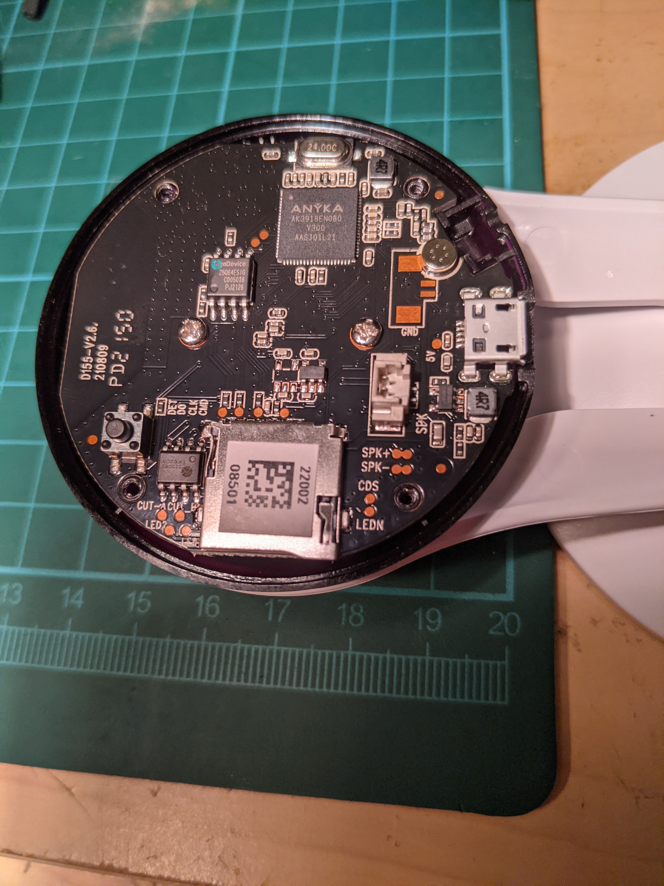

# geeni-aware

Attempt to hack a Geeni branded ip camera.  1080p model uses anyka v300 chipset.


<!-- Checklist -->
## Checklist

- [x] mtdblock dump
- [x] sdcard hack
- [ ] firmware replacemnt

sdcard folder contains a fully working hack.  Camera will connect to wifi, run dropbear ssh server and start an rtsp stream.  No need to do any initial setup.  Works right out of the box without any app required.

Format an sdcard with a FAT32 filesystem and allocation unit size of 32K (eg: sudo mkfs.fat -s 64 -n IPCAM /dev/sdX1 - solve for X).  Copy the contents of the sdcard folder from this repo to the root of your freshly formatted card.

**### Update wifi_cfg.ini with your wireless ssid and password. ###**

The root password will be set to cosmicpower - yes that is a Genie joke.

Firmware replacement seems unlikely unless binaries and library file sizes can be significantly reduced.  A hybrid mod to remove anyka services and possibly store dropbear on the internal flash seems more likely at least as a first attempt.

# System info



System uses U-boot which can be accessed via serial console.
```
U-Boot 2013.10.0-AK_V3.0.08 (Mar 05 2019 - 15:37:04)

DRAM:  64 MiB
8 MiB
Create flash partition table init OK!
ANYKA SDHC/MMC4.0: 0
Load Env CRC OK!
In:    serial
Out:   serial
Err:   serial
Net:   AKEthernet-0

Hit any key to stop autoboot:  3
```
default kernel
```
[root@anyka ~]$ uname -a
Linux anyka 3.4.35 #0 Tue Jul 28 11:14:02 CST 2020 armv5tejl GNU/Linux
```
cpuinfo

```
[root@anyka ~]$ cat /proc/cpuinfo 
Processor       : ARM926EJ-S rev 5 (v5l)
BogoMIPS        : 199.06
Features        : swp half fastmult edsp java 
CPU implementer : 0x41
CPU architecture: 5TEJ
CPU variant     : 0x0
CPU part        : 0x926
CPU revision    : 5

Hardware        : CLOUD39EV3_AK3918EV300_MNBD
Revision        : 0000
Serial          : 0000000000000000
```
