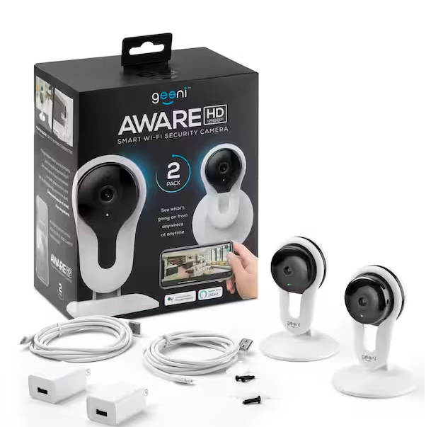

# geeni-aware

Attempt to hack a Geeni branded ip camera.  1080p model uses anyka v300 chipset.



sdcard folder contains the bare minimum required to setup wifi and run dropbear ssh server.  The root password will be set to cosmicpower - yes that is a Genie joke.

Update wifi_cfg.ini to include your wireless ssid and password.

# System info

System uses U-boot which can be accessed via serial console.
```
U-Boot 2013.10.0-AK_V3.0.08 (Mar 05 2019 - 15:37:04)

DRAM:  64 MiB
8 MiB
Create flash partition table init OK!
ANYKA SDHC/MMC4.0: 0
Load Env CRC OK!
In:    serial
Out:   serial
Err:   serial
Net:   AKEthernet-0

Hit any key to stop autoboot:  3
```
default kernel
```
[root@anyka ~]$ uname -a
Linux anyka 3.4.35 #0 Tue Jul 28 11:14:02 CST 2020 armv5tejl GNU/Linux
```
cpuinfo

```
[root@anyka ~]$ cat /proc/cpuinfo 
Processor       : ARM926EJ-S rev 5 (v5l)
BogoMIPS        : 199.06
Features        : swp half fastmult edsp java 
CPU implementer : 0x41
CPU architecture: 5TEJ
CPU variant     : 0x0
CPU part        : 0x926
CPU revision    : 5

Hardware        : CLOUD39EV3_AK3918EV300_MNBD
Revision        : 0000
Serial          : 0000000000000000
```
